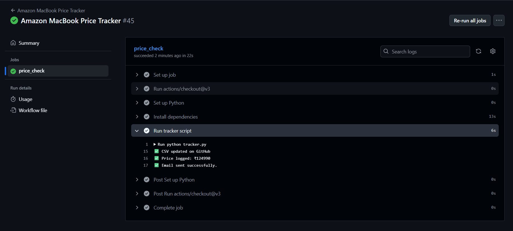
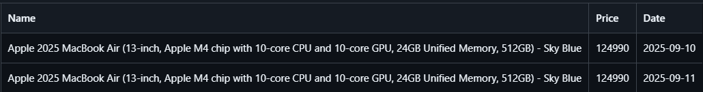
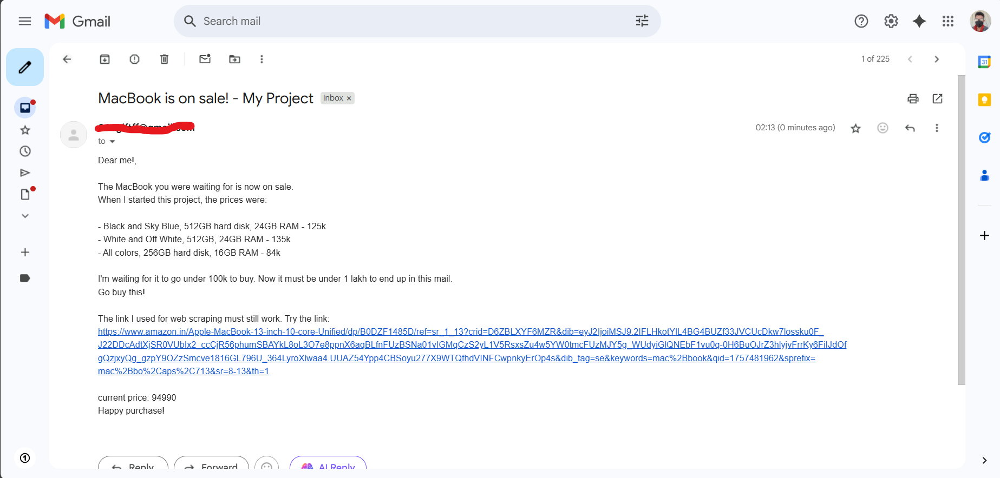
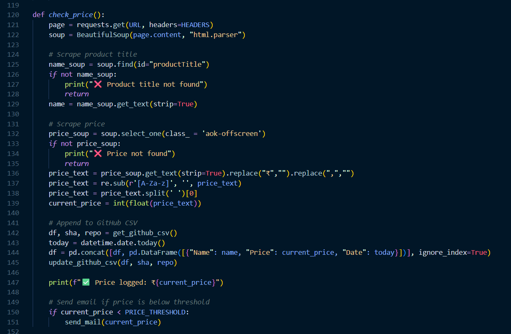

# Amazon Price Tracker – Fully Automated with Email Alerts[](https://github.com/SAHFEERULWASIHF/Amazon-MacBook-Price-Tracker/actions/workflows/main.yml)

Keep track of MacBook prices on **Amazon India** effortlessly! This project automatically logs daily price changes to a CSV file in this GitHub repository and sends an email alert when the price drops below your specified threshold. Fully automated using **GitHub Actions**, so it works even when your computer is off.

---

## 🚀 Features

* **Automated Price Tracking**: Runs daily at 12:30 UTC (6:00 PM IST) using GitHub Actions.
* **Email Alerts**: Notifies you immediately when the price goes below the set threshold (Ex:- 1,00,000).
* **Price History Logging**: Maintains a CSV log (`Amezon_web_Scraping_Project.csv`) with product name, price, and date.
* **Secure Credential Management**: Email credentials and GitHub tokens are safely stored in GitHub Secrets.

---

## 🛠️ How It Works

1. **GitHub Actions Workflow**: `.github/workflows/main.yml` triggers `tracker.py` every day.
2. **Web Scraping**: Fetches the product page with `requests` and parses the price with `BeautifulSoup`.
3. **Data Logging**: Reads existing CSV from GitHub, appends new price data, and pushes the update back.
4. **Email Notifications**: Sends an email alert if the price is below `PRICE_THRESHOLD`.

---

## 🖼 Screenshots

### 1. GitHub Actions Workflow
  
*Shows the workflow executing successfully on GitHub Actions.*

### 2. CSV Price Log
  
*Historical price data saved automatically in the repository.*

### 3. Email Notification
  
*Sample email alert triggered when price goes below the threshold.*

### 4. Script Preview
  
*Key parts of `tracker.py` showcasing scraping and CSV update logic.*

---

## ⚙️ Setup

### 1. Fork the Repository

Fork this repository to your GitHub account.

### 2. Configure GitHub Secrets

Navigate to **Settings → Secrets and variables → Actions** in your forked repo. Add the following secrets:

| Secret Name         | Description                                                   |
| ------------------- | ------------------------------------------------------------- |
| `PUBLIC_REPO_TOKEN` | GitHub Personal Access Token (repo scope) to read/write files |
| `EMAIL`             | Sender email address (e.g., Gmail)                            |
| `EMAIL_PASSWORD`    | App Password for your email                                   |
| `TO_EMAIL`          | Email address to receive notifications                        |

> **Tip:** Do not use your main email password; always use an App Password.

### 3. Customize Tracker

Open `tracker.py` and edit:

```python
URL = "YOUR_AMAZON_PRODUCT_URL"
PRICE_THRESHOLD = 100000  # set your desired price
```

### 4. Run Workflow

* Automatic: Runs daily at 12:30 UTC (6:00 PM IST).
* Manual: Go to **Actions → Amazon MacBook Price Tracker → Run workflow → Run workflow**.

---

## 💾 Project Files

```
Amazon-MacBook-Price-Tracker/
├── tracker.py
├── requirements.txt
├── amezonWebScrapping/
│   └── Amezon_web_Scraping_Project.csv
├── screenshots/
│   ├── workflow-run.png
│   ├── csv-log.png
│   ├── email-alert.png
│   └── code-preview.png
└── .github/
    └── workflows/main.yml
```

---

## 📦 Dependencies

The following Python libraries are required (installed automatically in the workflow):

* `requests`
* `beautifulsoup4`
* `pandas`
* `PyGithub`

---

## 💡 Notes

* Historical prices are preserved — the CSV appends new data daily.
* Fully automated: no need to run scripts locally.
* Perfect for portfolios to showcase automation, Python scripting, and GitHub Actions skills.

---

## 🗓 License

This project is **open-source** and free to use.
